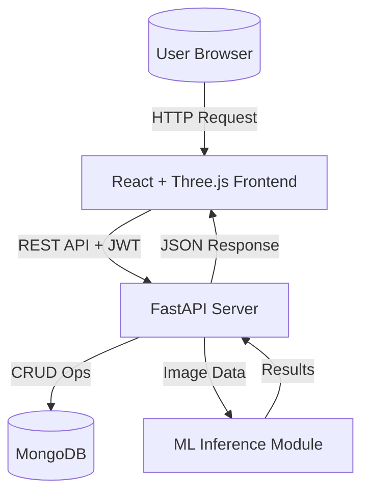

# System Architecture & Flowchart

## High-Level Architecture

## Application Flow
1. **User Authentication**:
   - User signs up with username, email, and password.
   - Credentials hashed via bcrypt; JWT access token returned.
2. **Dashboard & Upload**:
   - Authenticated user accesses Dashboard, uploads an image (JPG/PNG).
   - Frontend sends multipart/form-data to `/predict/` endpoint with JWT header.
3. **ML Processing**:
   - Backend preprocesses image (resize 224x224, normalize 1/255).
   - Base model inference running MobileNetV2 architecture determines `Benign` vs `Malignant`.
4. **Data Persistence**:
   - Image stream is converted to base64, prediction record is stored in MongoDB `predictions` collection linked to `user_id`.
5. **Result Display**:
   - Result payload returns to frontend.
   - Risk indicator parses prediction and confidence to assign 'Low', 'Medium', or 'High' risk status.
6. **Chatbot Interface**:
   - Voice-capable chatbot runs on client-side utilizing Web Speech API and simple NLP heuristics to answer skin condition inquiries.
